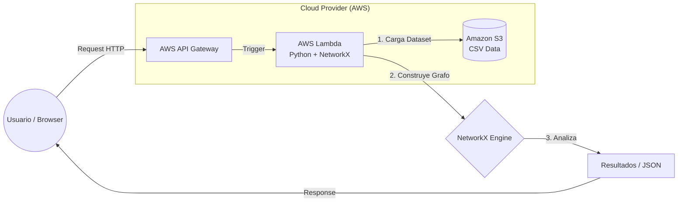

#  GraphWord - Sistema de Análisis de Grafos de Productos

Sistema de análisis de co-ocurrencias de productos basado en teoría de grafos, desplegado como API serverless en AWS.

##  Descripción del Proyecto

GraphWord es una aplicación de la asignatura **Tecnologías de Servicios para Ciencia de Datos** de la carrera **Ciencia e Ingeniería de Datos** que analiza patrones de compra de usuarios para identificar relaciones entre productos. Utiliza algoritmos de teoría de grafos para descubrir:
- **Conexiones ocultas** entre productos que se compran juntos
- **Caminos mínimos** entre diferentes productos
- **Clusters** de productos relacionados
- **Nodos hub** (productos más conectados)

###  Caso de Uso

A partir de un dataset de listas de compra, el sistema construye un grafo donde:
- **Nodos** = Productos
- **Aristas** = Co-ocurrencia (productos comprados juntos)
- **Peso** = Frecuencia de co-ocurrencia

---

##  Interfaz Web Gráfica

El proyecto cuenta con una **interfaz web moderna integrada** directamente en el endpoint raíz de la API. No requiere instalación de frontend adicional.

 **[Acceder a la Interfaz Web](https://nujkmosb6l.execute-api.us-east-1.amazonaws.com/)**

Características de la interfaz:
- **Visualización de estadísticas** en tiempo real (nodos y aristas)
- **Formularios interactivos** con **autocompletado de productos**
- **Lista desplegable** con todos los productos disponibles en el grafo
- **Acceso directo** a todos los endpoints (Clusters, Top conectividad, etc.)
- **Diseño responsive** y modo oscuro

---

##  Funcionalidades

### 1. Camino Mínimo
Encuentra la ruta más corta entre dos productos basándose en conexiones de co-ocurrencia. Útil para sistemas de recomendación.

### 2. Todos los Caminos
Lista todas las trayectorias posibles entre dos nodos (limitado a profundidad 3) para observar la densidad de la red.

### 3. Distancia Máxima (Diámetro)
Calcula el camino más largo sin ciclos en el subgrafo principal. Mide la "extensión" del ecosistema de datos.

### 4. Identificación de Clusters
Detecta grupos de productos con alta conectividad interna. Revela categorías lógicas basadas en comportamiento del usuario.

### 5. Nodos con Alto Grado
Identifica los productos "Hub" con mayor número de conexiones. Son artículos esenciales que conectan múltiples categorías.

### 6. Selección por Grado
Filtra nodos con un número específico de conexiones. Útil para identificar productos de nicho o consumo masivo.

### 7. Nodos Aislados
Identifica productos sin conexiones. Representan artículos que se compran siempre de forma individual.

---

##  Cómo Ejecutar

### Opción 1: Localmente con Docker

```bash
# Construir imagen
docker build -t graphword-api .

# Ejecutar contenedor
docker run -p 8000:8000 graphword-api
```

Acceder a: `http://localhost:8000/docs`

### Opción 2: Localmente con Python

```bash
# Instalar dependencias
pip install -r requirements.txt

# Ejecutar API
py -m uvicorn api:app --reload

# Ejecutar interfaz gráfica (Streamlit)
streamlit run interfaz_grafica.py
```

### Opción 3: API en la Nube (Producción)

La API está desplegada y disponible públicamente:

 **https://nujkmosb6l.execute-api.us-east-1.amazonaws.com/**

---

##  Arquitectura AWS

El proyecto utiliza los siguientes servicios de AWS (dentro del **Free Tier**):

| Servicio | Propósito | Detalle |
|----------|-----------|---------|
| **Amazon S3** | Almacenamiento de datos | Bucket `graphword-data-bucket-2026` con el dataset CSV |
| **AWS Lambda** | Ejecución serverless | Función `graphword-api` con Python 3.11, 1024MB RAM, 60s timeout |
| **API Gateway** | Exposición HTTP | API HTTP pública con integración Lambda |
| **IAM** | Permisos y seguridad | Rol `graphword-lambda-role` con acceso a S3 y CloudWatch |
| **Lambda Layers** | Dependencias | Layers de Pandas (AWS SDK) y NetworkX (custom) |

### Diagrama de Arquitectura

---

##  Endpoints de la API

### URL Base
```
https://nujkmosb6l.execute-api.us-east-1.amazonaws.com
```

### Endpoints Disponibles

| Endpoint | Método | Descripción | Parámetros | Tiempo |
|----------|--------|-------------|------------|--------|
| `/` | GET | Estado de la API y menú de opciones | - | ~0.2s* |
| `/nodos-alto-grado` | GET | Top 10 productos más conectados | - | ~0.2s |
| `/camino-minimo` | GET | Camino más corto entre dos productos | `origen`, `destino` | ~0.2s |
| `/nodos-aislados` | GET | Productos sin conexiones | - | ~0.2s |
| `/clusteres` | GET | Grupos de productos conectados | - | ~7s |

> *El primer acceso puede tardar ~10s ("cold start" de Lambda cargando datos)

---

##  Informe de Rendimiento de la API

| Endpoint | URL Completa | Funcionalidad | Tiempo de Respuesta |
|----------|--------------|---------------|---------------------|
| Raíz | [/](https://nujkmosb6l.execute-api.us-east-1.amazonaws.com/) | Muestra menú con todos los endpoints disponibles y estadísticas del grafo (3,942 nodos, 885 aristas) | **0.2s** (después del cold start) |
| Nodos Alto Grado | [/nodos-alto-grado](https://nujkmosb6l.execute-api.us-east-1.amazonaws.com/nodos-alto-grado) | Devuelve los 10 productos con más conexiones en el grafo | **0.2s** |
| Camino Mínimo | [/camino-minimo?origen=pan&destino=leche](https://nujkmosb6l.execute-api.us-east-1.amazonaws.com/camino-minimo?origen=pan&destino=leche) | Calcula la ruta más corta entre dos productos | **0.19s** |
| Nodos Aislados | [/nodos-aislados](https://nujkmosb6l.execute-api.us-east-1.amazonaws.com/nodos-aislados) | Lista productos que no se compran junto con otros | **0.2s** |
| Clusters | [/clusteres](https://nujkmosb6l.execute-api.us-east-1.amazonaws.com/clusteres) | Identifica grupos de productos relacionados mediante componentes conectados | **7.26s** |

### Notas de Rendimiento
- **Cold Start**: La primera invocación tarda ~10 segundos porque Lambda debe cargar el dataset desde S3
- **Warm Requests**: Las siguientes peticiones son muy rápidas (~0.2s) gracias al cacheo en memoria
- **Clusteres**: Es el endpoint más lento debido al cálculo de componentes conectados sobre todo el grafo

---

##  Estructura del Proyecto

```
GraphWorld/
├── api.py                 # API FastAPI (local)
├── Main.py               # CLI interactivo
├── analisis_grafo.py     # Clase GraphAnalyzer con NetworkX
├── procesamiento.py      # ETL de datos CSV
├── interfaz_grafica.py   # Dashboard Streamlit
├── datos.py              # Script para crear versión lite del CSV
├── Dockerfile            # Contenedor para despliegue
├── requirements.txt      # Dependencias Python
├── aws/                  # Código para AWS Lambda
│   ├── lambda_function.py
│   └── trust-policy.json
└── README.md
```

---

##  Tecnologías Utilizadas

- **Python 3.11**
- **FastAPI** - Framework web para APIs
- **NetworkX** - Análisis de grafos
- **Pandas** - Procesamiento de datos
- **Streamlit** - Interfaz gráfica interactiva
- **AWS Lambda** - Computación serverless
- **AWS S3** - Almacenamiento en la nube
- **AWS API Gateway** - Exposición de APIs HTTP

---

## Autores del proyecto
- **Daniel Medina González**
- **Ivana Augustíneková**
